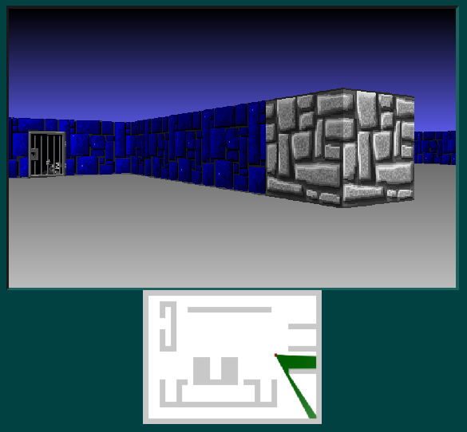

# HTML5 Raycast

A Wolfenstein 3D style JavaScript Raycaster using the browser's HTML5 Canvas for rendering.

[View Demo Here](https://andrew-lim.github.io/html5-raycast/raycast3d.htm)

Heavily modified from [this article by Jacob Seidelin](http://dev.opera.com/articles/view/creating-pseudo-3d-games-with-html-5-can-1/).

Main Differences from original article:
- **A single &lt;canvas&gt;** is now used for rendering the main scene. In the original article &lt;div&gt; and &lt;img&gt; strips 
  were used to render the walls, floor and ceiling.
- **Unit circle coordinates** are now used for the player's rotation. So turning left counterclockwise 
  is a positive angle.
- **Walls and tiles now use fixed game units**. The player's position in a tile is no longer a floating point 
  value between 0 to 1, but an integer between 0 to 128. In the original Wolfenstein 3D game a wall was apparently 8 feet and 1 foot was 16 game units.
- **Horizontal walls** now used a **darker texture**.

Other links
- [F. Permadi's Raycasting Tutorial](https://permadi.com/1996/05/ray-casting-tutorial-7/). The raycast math used in this demo is closely based on this tutorial.
- [Game Engine Black Book: Wolfenstein 3D](https://fabiensanglard.net/gebbwolf3d/) Contains useful information about the original raycasting used in Wolfenstein 3D.
- [Make Your Own Raycaster Game](https://www.youtube.com/watch?v=gYRrGTC7GtA). Cool YouTube video with excellent raycasting animations.