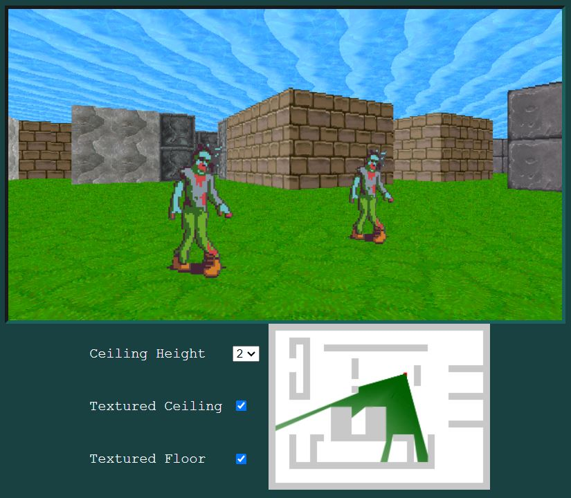

# HTML5 Raycast

A Wolfenstein 3D style JavaScript Raycaster using the browser's HTML5 Canvas for rendering.

[View Demo Here](https://andrew-lim.github.io/html5-raycast/raycast3d.htm)

Heavily modified from [this article by Jacob Seidelin](http://dev.opera.com/articles/view/creating-pseudo-3d-games-with-html-5-can-1/).

Main Differences from original article:
- **A single &lt;canvas&gt;** is now used for rendering the main scene. In the original article &lt;div&gt; and &lt;img&gt; strips
  were used to render the walls, floor and ceiling. The walls are now drawn by manually setting the canvas pixels.
- **Unit circle coordinates** are now used for the player's rotation. So turning left counterclockwise
  is a positive angle.
- **Walls and tiles now use fixed game units**. The player's position in a tile is no longer a floating point
  value between 0 to 1, but an integer between 0 to 1280. A higher integer value seems to prevent tearing between adjacent walls.
- **Horizontal walls** now use a **darker texture**.
- **Texture mapped** floor and ceiling.

## Building

There is no build step but you will need a HTTP webserver like [nginx](https://nginx.org/) to run and test locally.
If you try to load the .htm file directly with the `file://` protocol you'll probably encounter an error like "The canvas has been tainted by cross-origin data."

## Other links
- [F. Permadi's Raycasting Tutorial](https://permadi.com/1996/05/ray-casting-tutorial-7/). The raycast math used in this demo is closely based on this tutorial.
- [Game Engine Black Book: Wolfenstein 3D](https://fabiensanglard.net/gebbwolf3d/) Contains useful information about the original raycasting used in Wolfenstein 3D.
- [Make Your Own Raycaster Game](https://www.youtube.com/watch?v=gYRrGTC7GtA). Cool YouTube video with excellent raycasting animations.

## Asset Credits

https://opengameart.org/content/big-pack-of-hand-painted-tiling-textures

https://opengameart.org/content/first-person-dungeon-crawl-art-pack